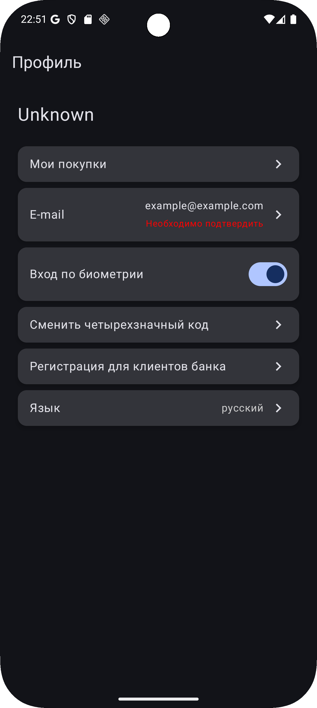
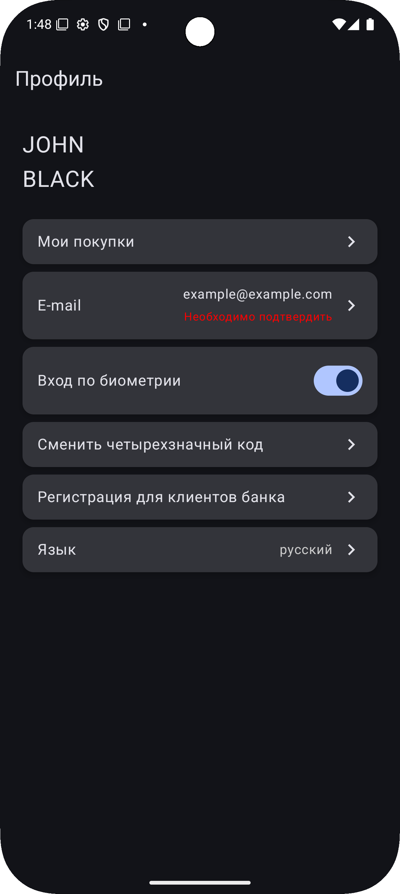
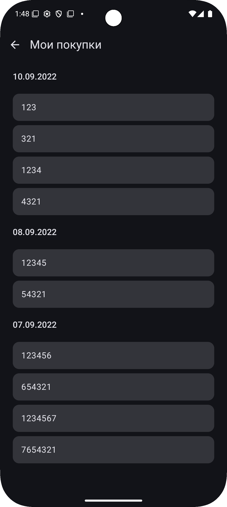
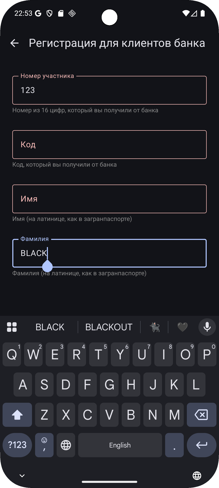
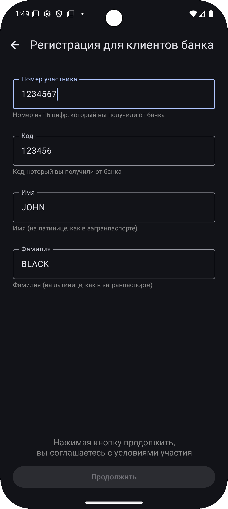

APK доступен в разделе [Releases](https://github.com/HSact/UserFormPurchasesApp/releases)
## О проекте

Android-приложение с тремя экранами:

- Главный экран с навигацией  
- Форма регистрации с валидацией (все поля обязательны, номер участника — 16 цифр)  
- Экран списка покупок, сгруппированных по дате  

---

## Архитектура и технологии

- Kotlin, Jetpack Compose  
- Hilt для DI
- Вынесены модули `domain` и `data`
  - **`domain`** — содержит бизнес-логику приложения: use case, интерфейсы репозиториев, модели домена. Не зависит от других модулей
  - **`data`** — содержит реализацию репозиториев и преобразования между слоями. Зависит от `domain`
  - **`app`** — основной модуль. Содержит UI, ViewModel, навигацию. Зависит от `domain` и `data`
- Coroutines и Flow для асинхронности и реактивности
- JetPack DataStore для хранения данных о пользователе
- StateFlow и sealed классы для управления состоянием UI  
- Локальный источник данных — JSON из assets  
- Группировка и сортировка данных реализованы в UseCase   

---

## Структура проекта

```text
UserFormPurchasesApp/
│
├── app/                          # Основной модуль (UI, навигация, DI)
│   ├── ui/                       # UI-слой
│   │   ├── screens/              # Экраны приложения
│   │   │   ├── profile/          # Профиль: UI, ViewModel, UiState
│   │   │   ├── registration/     # Регистрация: UI, ViewModel, UiState, Intent, Field
│   │   │   └── purchases/        # Покупки: UI, ViewModel, UiState
│   │   └── components/           # Общие переиспользуемые UI-компоненты
│   ├── navigation/               # Навигация между экранами
│   └── di/                       # DI-модули Hilt
│
├── domain/                       # Бизнес-логика (не зависит от других модулей)
│   ├── model/                    # Модели домена
│   ├── repository/               # Интерфейсы репозиториев
│   └── usecase/                  # Use case-ы
│
├── data/                         # Работа с источниками данных
│   ├── datasource/               # DataStoreManager (Реализация  DataStore) и PurchaseDataStore (Загрузка данных из JSON)
│   ├── di/                       # Биндинг интерфейсов репозиториев и реализации
│   ├── repository/               # Реализация репозиториев
│   ├── model/                    # Модели data-слоя
│   └── mapper/                   # Преобразование моделей между слоями

```

---

## Особенности реализации

- UseCase возвращает Flow сгруппированных по дате покупок  
- ViewModel подписывается на Flow и обновляет UiState 
- Валидация формы регистрации: проверка полей, динамическое управление состоянием кнопки, визуальная индикация ошибок
- Список покупок отображается в LazyColumn, с датой в роли заголовка группы 
- Ошибки загрузки данных отображаются в UI

---

## Скриншоты

<table>
  <tr>
    <td></td>
    <td></td>
    <td></td>
  </tr>
  <tr>
    <td></td>
    <td></td>
    <td></td>
  </tr>
</table>
